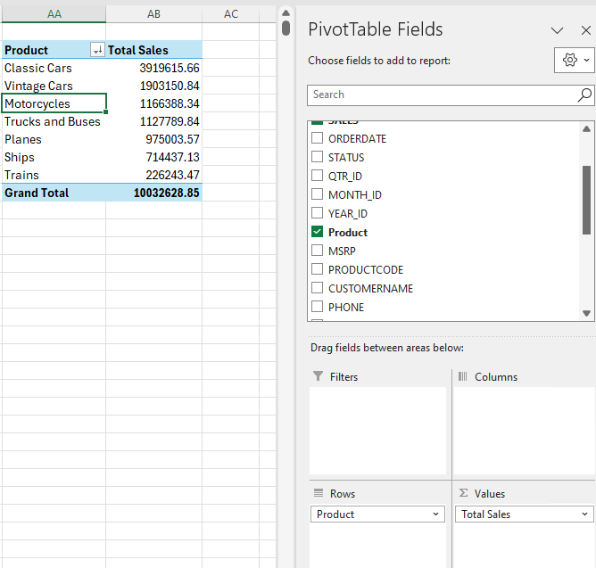

# Data Analysis

## 1. Download Sample Data

Download sample dataset from here [sales_data_sample.csv](https://github.com/afifhusman/AI_Data_Analysis/blob/main/Sample%20Data/sales_data_sample.csv) \
adapted and modified from [source](https://www.kaggle.com/datasets/kyanyoga/sample-sales-data?resource=download&select=sales_data_sample.csv).

## 2. Descriptive Analysis

Enable Analysis Toolpak in Excel

https://github.com/afifhusman/AI_Data_Analysis/assets/69129166/5f318dda-4189-4110-a6be-001cdea2790e

## 3. Pivot Table

## AI Assisted Analysis

Home -> Analyze Data

