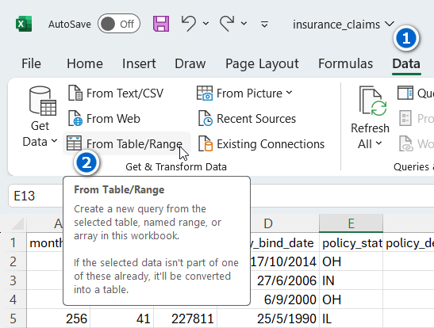
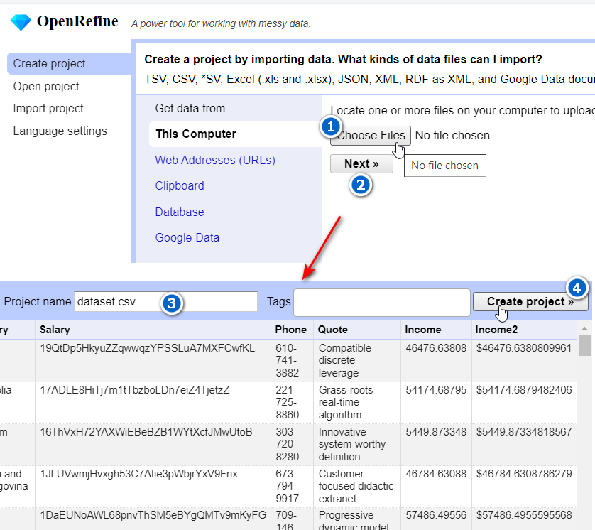

#Welcome
Github Repo For PruBSN AI for Data Analysis Training

# Data Cleaning
## 1. Download Dataset Sample

Download sample dataset from here [unclean_data.csv](https://github.com/afifhusman/AI_Data_Analysis/blob/main/Sample%20Data/unclean_data.csv) \
(adapted and modified from [source](https://github.com/Jcharis/Data-Cleaning-Practical-Examples/blob/91a8c6146df89593698257f68c9832bc8a9fb20f/unclean_data.csv)) \

  

## 2. Opening Data in Power Query

 

## 2. Opening Data in OpenRefine

 

## 3. Power Query Data Cleaning Cheatsheet
 

| Task   | Key  |
|------------|------------|
| Remove Duplicates | Home -> Remove Rows -> Remove Duplicates  |
| Add Index Column | Add Column -> Index Column -> From 1  |
| Add Index Column | Add Column -> Index Column -> From 0 / From 1 / Custom  |
| Add Prefix or Suffix | Transform -> Format -> Add Prefix / Add Suffix  |
| Create Custom Columns | Home -> Custom Column -> Enter Formula  |
| Change Letter Cases | Transform -> Format -> Upper Case/ Lower Case  |
| Change Letter Cases (new column) | Add Column -> Format -> Upper Case/ Lower Case  |
| Create Custom Columns | Home -> Remove Columns   |
| Transpose Data | Transform -> Use First Row as Headers -> Use Headers as First Row -> Transpose -> Use First Row as Headers    |
| Split Data into Columns| Home -> Split Columns -> Choose Delimeter   |
| Remove Extra Space| Transform -> Format -> Trim  |
| Remove Line Breaks| Transform -> Format -> Clean  |
| Remove Line Breaks| Home  -> Remove Rows -> Remove Errors  |

  

## 4. Power Query Data Cleaning Cheatsheet
