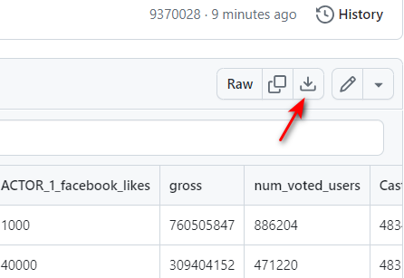

#Welcome
Github Repo For PruBSN AI for Data Analysis Training

#Data Cleaning
## 1. Download Dataset Sample

Download sample dataset from here [unclean_data.csv](https://github.com/afifhusman/AI_Data_Analysis/blob/main/Sample%20Data/unclean_data.csv) \
(adapted and modified from [source](https://github.com/Jcharis/Data-Cleaning-Practical-Examples/blob/91a8c6146df89593698257f68c9832bc8a9fb20f/unclean_data.csv)) \

  

## 2. Opening Data in Power Query

